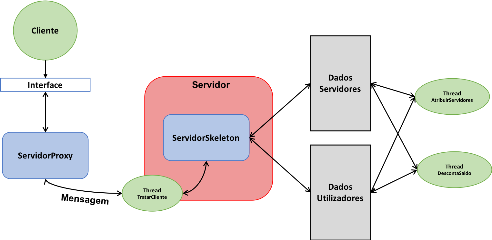
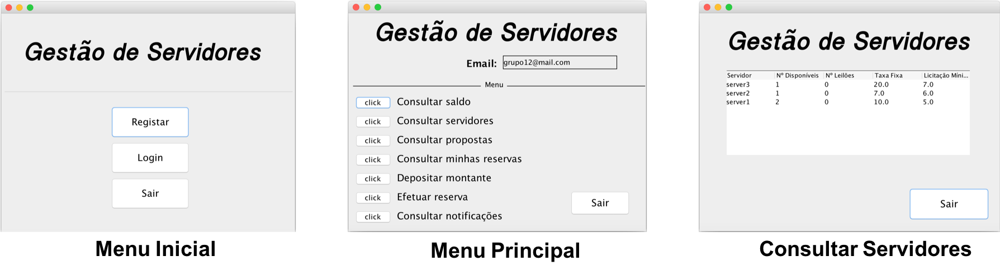

# Sistemas Distribuídos - Alocação de servidores na nuvem
Projeto Sistemas Distribuídos 2018/2019, Mestrado Integrado em Engenharia Informática, Universidade do Minho, Braga - Portugal

Neste projeto pretende-se desenvolver um serviço de alocação de servidores na nuvem e de contabilização do custo incorrido pelos utilizadores.

### Arquitetura final

## Autores

* [Joel Rodrigues](https://github.com/JoelRodrigues58)
* [Raphael Oliveira](https://github.com/raphael28)
* [Francisco Araújo](https://github.com/franciscoaraujo51)
* [Fábio Araújo](https://github.com/narcos088)
